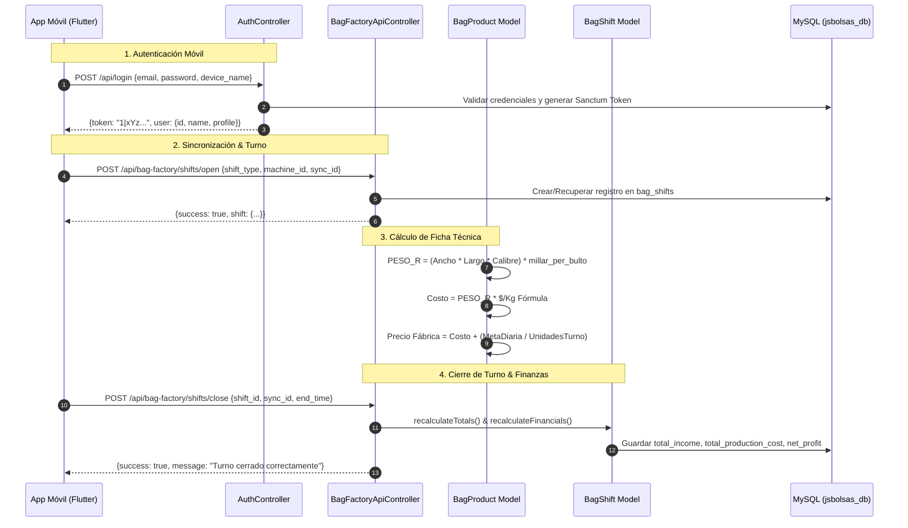

# 📘 REPORTE TÉCNICO DE FLUJO DE EJECUCIÓN (RUNTIME FLOW)
## Sistema JSBolsas Pro (Fábrica de Bolsas & App Móvil)

---

## 1. MAPA DE ARCHIVOS Y RUTAS (¿Dónde está el código?)

### A. Backend (Laravel 10)
| Capa / Módulo | Archivo / Ruta Absoluta | Responsabilidad Principal |
| :--- | :--- | :--- |
| **Controlador Web** | [`app/Http/Controllers/BagFactoryWebController.php`](file:///C:/laragon/www/jsbolsas/app/Http/Controllers/BagFactoryWebController.php) | Gestión de Fichas Técnicas, Simulador de Costos, Báscula, Monitor en Vivo y Cierre de Turnos vía Web. |
| **Controlador API (Planta)** | [`app/Http/Controllers/Api/BagFactoryApiController.php`](file:///C:/laragon/www/jsbolsas/app/Http/Controllers/Api/BagFactoryApiController.php) | Endpoints consumidos por la APK: catálogo, apertura/cierre de turnos y sincronización idempotente. |
| **Controlador Auth API** | [`app/Http/Controllers/Api/AuthController.php`](file:///C:/laragon/www/jsbolsas/app/Http/Controllers/Api/AuthController.php) | Autenticación móvil con emisión de tokens Sanctum. |
| **Modelo Ficha Técnica** | [`app/Models/BagProduct.php`](file:///C:/laragon/www/jsbolsas/app/Models/BagProduct.php) | Lógica matemática de peso físico, factor de escala (`millar_per_bulto`), simulación de precios y costos de resina. |
| **Modelo Turnos** | [`app/Models/BagShift.php`](file:///C:/laragon/www/jsbolsas/app/Models/BagShift.php) | Cálculo de totales de turno, costos operativos fijos, PnL y márgenes netos reales. |
| **Modelo Producción / Pesaje** | [`app/Models/BagProduction.php`](file:///C:/laragon/www/jsbolsas/app/Models/BagProduction.php) | Registro de pesajes, generación de códigos `PKG-QR`, control de tara y desglose JSON de bobinas. |
| **Modelo Fórmulas y Materias** | [`app/Models/ProductionFormula.php`](file:///C:/laragon/www/jsbolsas/app/Models/ProductionFormula.php), [`app/Models/RawMaterial.php`](file:///C:/laragon/www/jsbolsas/app/Models/RawMaterial.php) | Costo promedio ponderado $/Kg según formulación química y trazabilidad de materias primas. |
| **Migración Productos** | `database/migrations/2026_08_30_000000_create_bag_products_table.php` | Esquema de fichas técnicas con soporte decimal para factores de escala y micras. |
| **Migración Turnos & Báscula** | `database/migrations/2026_08_31_000001_create_bag_shifts_table.php`, `..._000002_create_bag_productions_table.php` | Tablas de jornadas de operarios, máquinas asignadas, campos de supervisión y metadatos JSON. |
| **Rutas API y Web** | [`routes/api.php`](file:///C:/laragon/www/jsbolsas/routes/api.php), [`routes/web.php`](file:///C:/laragon/www/jsbolsas/routes/web.php) | Definición de endpoints con middleware `auth:sanctum` y rutas web autenticadas. |

---

### B. App Móvil Flutter (`mobile_bolsas_app`)
| Capa / Módulo | Archivo / Ruta Absoluta | Responsabilidad Principal |
| :--- | :--- | :--- |
| **Punto de Entrada & Auth** | [`mobile_bolsas_app/lib/main.dart`](file:///C:/laragon/www/jsbolsas/mobile_bolsas_app/lib/main.dart) | Inicialización de base de datos SQLite, gestión de sesión y pantalla de Login de Planta. |
| **Base de Datos Local (SQLite)** | [`mobile_bolsas_app/lib/services/local_db.dart`](file:///C:/laragon/www/jsbolsas/mobile_bolsas_app/lib/services/local_db.dart) | Clase `LocalDatabaseService`: Tablas `cached_products`, `cached_machines`, `local_shifts` y `local_productions`. |
| **Servicio de Sincronización** | [`mobile_bolsas_app/lib/services/sync_service.dart`](file:///C:/laragon/www/jsbolsas/mobile_bolsas_app/lib/services/sync_service.dart) | Clase `SyncService`: Cola offline-first, actualización de catálogos y sincronización idempotente vía HTTP POST. |
| **Pantalla Operario (Pesajes)** | [`mobile_bolsas_app/lib/screens/operator_dashboard.dart`](file:///C:/laragon/www/jsbolsas/mobile_bolsas_app/lib/screens/operator_dashboard.dart) | Apertura/cierre de turnos, pesaje en báscula, desglose de bobinas por rollo y sincronización visual. |
| **Pantalla Supervisor** | [`mobile_bolsas_app/lib/screens/supervisor_dashboard.dart`](file:///C:/laragon/www/jsbolsas/mobile_bolsas_app/lib/screens/supervisor_dashboard.dart) | Aprobación de bultos, ajuste de peso de tara, rechazo por calidad e impresión térmica. |
| **Pantalla Almacén (Levantamiento)** | [`mobile_bolsas_app/lib/screens/warehouse_lifting_screen.dart`](file:///C:/laragon/www/jsbolsas/mobile_bolsas_app/lib/screens/warehouse_lifting_screen.dart) | Recepción de bultos aprobados y escaneo QR hacia el inventario general. |
| **Escáner de Cámara** | [`mobile_bolsas_app/lib/screens/camera_scanner_screen.dart`](file:///C:/laragon/www/jsbolsas/mobile_bolsas_app/lib/screens/camera_scanner_screen.dart) | Lector de códigos QR físicos para auditoría instantánea. |

---

## 2. FLUJO DE DATOS EN EL BACKEND (Laravel 10)



### A. Autenticación Móvil (Sanctum)
1. **Endpoint:** `POST /api/login` (manejado por [`AuthController::login`](file:///C:/laragon/www/jsbolsas/app/Http/Controllers/Api/AuthController.php#L15)).
2. **Validación:** Requiere `email`, `password` y `device_name`.
3. **Emisión de Token:** Ejecuta `$token = $user->createToken($request->device_name)->plainTextToken;`.
4. **Persistencia:** El token se almacena en la tabla `personal_access_tokens` de MySQL. En cada petición subsiguiente, la APK envía la cabecera `Authorization: Bearer <token>`, verificada automáticamente por el middleware `auth:sanctum`.

---

### B. Lógica Matemática de la Ficha Técnica ([`BagProduct.php`](file:///C:/laragon/www/jsbolsas/app/Models/BagProduct.php))

#### 1. Peso Físico Teórico del Millar ($P_{\text{teórico}}$):
Para bolsas tradicionales (ancho, largo y calibre en micras/pulgadas):
$$P_{\text{teórico}} = \text{Ancho (in)} \times \text{Largo (in)} \times \text{Calibre}$$
*(Si el producto es marcado como `is_variable_quantity` [Bobina / Rollo], $P_{\text{teórico}} = 1.0000\text{ Kg}$).*

#### 2. Peso Real por Unidad de Venta ($P_R$ o `PESO_R`):
Permite modelar bultos grandes, millares o fracciones mediante el factor de escala universal `millar_per_bulto`:
$$P_R = P_{\text{teórico}} \times \text{millar\_per\_bulto}$$

*Ejemplos según `millar_per_bulto`:*
- Bulto de 20 millares (`millar_per_bulto = 20.0`): $P_R = P_{\text{teórico}} \times 20.0$
- Paquete de 100 bolsas (`millar_per_bulto = 0.1`): $P_R = P_{\text{teórico}} \times 0.1$
- Bobina variable (`millar_per_bulto = 1.0`): $P_R = 1.0000\text{ Kg}$

#### 3. Costo de Materia Prima por Unidad de Venta:
Obtiene el costo ponderado $/Kg de la fórmula activa vinculada (`ProductionFormula::currentVersion->cost_per_kg`):
$$\text{Costo MP} = P_R \times \frac{\$}{\text{Kg}}(\text{Fórmula})$$

#### 4. Cálculo Inverso de Precio Fábrica (`simulateFactoryPriceFromDailyTarget`):
Calcula el precio unitario requerido para cumplir con la meta de ganancia diaria:
$$\text{Precio Fábrica} = \text{Costo MP} + \left( \frac{\text{Meta Diaria (\$)}}{\text{Bultos por Turno}} \right)$$

#### 5. Escala de Precios Comerciales:
- **Nivel 1 (Distribuidor):** $\text{Precio Fábrica} \times 1.10$ (+10%)
- **Nivel 2 (Mayorista):** $\text{Precio Fábrica} \times 1.17$ (+17%)
- **Nivel 3 (Minorista / Detal):** $\text{Precio Fábrica} \times 1.21$ (+21%)

---

### C. Cierre de Turno y Balance Financiero ([`BagShift.php`](file:///C:/laragon/www/jsbolsas/app/Models/BagShift.php))
1. **Endpoint:** `POST /api/bag-factory/shifts/close` (ejecuta [`BagFactoryApiController::closeShift`](file:///C:/laragon/www/jsbolsas/app/Http/Controllers/Api/BagFactoryApiController.php#L235)).
2. **Actualización de Estado:** Marca el registro en `bag_shifts` con `status = 'closed'` y `end_time = Carbon::parse($request->end_time)`.
3. **Ejecución de Métricas:** Invoca `recalculateTotals()` y `recalculateFinancials()`:
   - Suma el peso real total ($\text{Kg}$) y paquetes acumulados de la relación `productions()`.
   - Suma ingresos proyectados ($\text{Cantidad} \times \text{Precio Fábrica}$).
   - Resta el costo de materias primas utilizadas ($\text{Cantidad} \times \text{Costo MP}$).
   - Resta el costo operativo fijo por turno configurado en `bag_cost_settings.shift_fixed_cost`.
   - Calcula y persiste:
     $$\text{net\_profit} = \text{total\_income} - (\text{raw\_cost} + \text{fixed\_operational\_cost})$$
     $$\text{profit\_margin\_percent} = \left( \frac{\text{net\_profit}}{\text{total\_income}} \right) \times 100$$

---

## 3. FLUJO DE DATOS EN LA APK MÓVIL (Flutter / SQLite)

### A. Modo Offline & Base de Datos SQLite Local ([`local_db.dart`](file:///C:/laragon/www/jsbolsas/mobile_bolsas_app/lib/services/local_db.dart))
La base de datos SQLite se inicializa en `bag_factory_local.db` (Versión 3) con las siguientes 4 tablas:

```sql
-- 1. Catálogo local de productos para autocompletado offline
CREATE TABLE cached_products (
  id INTEGER PRIMARY KEY,
  name TEXT NOT NULL,
  sku TEXT,
  cost REAL,
  price REAL,
  is_variable_quantity INTEGER DEFAULT 0
);

-- 2. Catálogo local de máquinas extrusoras y selladoras
CREATE TABLE cached_machines (
  id INTEGER PRIMARY KEY,
  code TEXT NOT NULL,
  name TEXT NOT NULL,
  type TEXT NOT NULL,
  status TEXT
);

-- 3. Turnos locales con bandera de sincronización
CREATE TABLE local_shifts (
  id INTEGER PRIMARY KEY AUTOINCREMENT,
  server_id INTEGER,
  machine_id INTEGER,
  shift_type TEXT NOT NULL,
  start_time TEXT NOT NULL,
  end_time TEXT,
  status TEXT NOT NULL,
  total_packages REAL DEFAULT 0,
  total_weight REAL DEFAULT 0,
  notes TEXT,
  sync_id TEXT UNIQUE NOT NULL,
  is_synced INTEGER DEFAULT 0
);

-- 4. Pesajes locales registrados por el operario
CREATE TABLE local_productions (
  id INTEGER PRIMARY KEY AUTOINCREMENT,
  server_id INTEGER,
  shift_sync_id TEXT NOT NULL,
  product_id INTEGER NOT NULL,
  product_name TEXT NOT NULL,
  quantity REAL NOT NULL,
  weight REAL NOT NULL,
  recorded_at TEXT NOT NULL,
  status TEXT DEFAULT 'pending_review',
  sync_id TEXT UNIQUE NOT NULL,
  metadata TEXT,
  is_synced INTEGER DEFAULT 0
);
```

---

### B. Estructura JSON para Bobinas de Peso Libre (`metadata`)
Cuando un producto es de tipo bobina (`is_variable_quantity = 1`), el operario no pesa paquetes homogéneos, sino rollos individuales de peso libre. 

La APK genera y almacena en la columna `local_productions.metadata` el siguiente payload JSON estructurado:

```json
{
  "is_roll": true,
  "rolls": [
    {
      "roll_num": 1,
      "weight": 14.85,
      "color": "Transparente"
    },
    {
      "roll_num": 2,
      "weight": 15.20,
      "color": "Negro"
    },
    {
      "roll_num": 3,
      "weight": 14.95,
      "color": "Azul"
    }
  ],
  "total_rolls": 3,
  "gross_weight": 45.00,
  "core_tare_deduction": 0.00,
  "net_weight": 45.00
}
```
*En el backend Laravel, la columna `bag_productions.metadata` está casteada como `'metadata' => 'array'`, lo que permite auditar y mostrar el desglose de cada rollo en la báscula web y reportes sin requerir migraciones complejas.*

---

### C. Protocolo de Sincronización Idempotente con `sync_id` / `sync_uuid` ([`sync_service.dart`](file:///C:/laragon/www/jsbolsas/mobile_bolsas_app/lib/services/sync_service.dart))

1. **Generación Local de Identificadores:**
   - Cada turno nuevo genera un UUID local: `sync_id = "SHIFT-" + Uuid().v4();`.
   - Cada pesaje genera un UUID local: `sync_id = "PROD-" + Uuid().v4();`.
   - Se guardan en SQLite con `is_synced = 0`.

2. **Proceso de Sincronización Masiva (`POST /api/bag-factory/productions/sync`):**
   - La APK envía el lote pendiente:
   ```json
   {
     "shift_id": 42,
     "shift_sync_id": "SHIFT-9a8b7c6d-5e4f-3a2b-1c0d",
     "productions": [
       {
         "sync_id": "PROD-11223344-5566-7788-99aa",
         "product_id": 3,
         "quantity": 5.0,
         "weight": 72.50,
         "recorded_at": "2026-09-07T14:30:00Z",
         "metadata": { "is_roll": false }
       }
     ]
   }
   ```

3. **Garantía de Idempotencia en el Backend ([`BagFactoryApiController.php:195`](file:///C:/laragon/www/jsbolsas/app/Http/Controllers/Api/BagFactoryApiController.php#L195)):**
   - El backend ejecuta `BagProduction::updateOrCreate(['sync_id' => $item['sync_id']], [...])`.
   - **Tolerancia a Fallos de Red:** Si la conexión se interrumpe durante la respuesta y la APK reintenta enviar el mismo lote, la base de datos MySQL no duplica los pesajes ni altera los totales acumulados del turno.
   - Una vez recibida la respuesta `HTTP 200`, la APK ejecuta `markProductionSynced(syncId)` marcando `is_synced = 1` en SQLite local.
